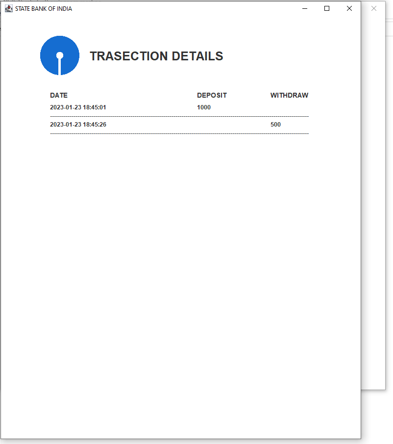
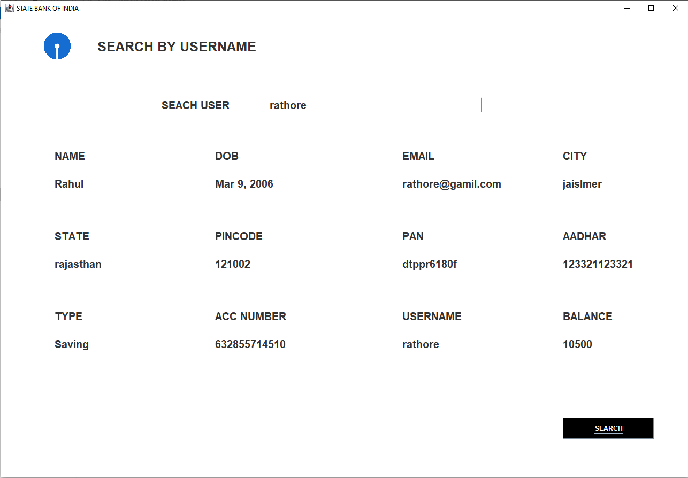

# Online-Banking-System (SBI Banking)
- A individual project of an online Banking system.
- The Aim of this application is to form a bridge between Bank and customers.
- project code = -tired-calendar-1389

# problem statement
- 	The Aim of this application is to form a bridge between bank and customers.
- Create bank account throw this app whenever they want.
- 	The account owners must be able to sign in to the application to Deposite and withdraw amount and see all transection. 

## Types of users
- Customer 
- Admin

## Tech Stack Used

- java
- MySql
- Java swing pacakges
- JDBC
- Intellij Idea

